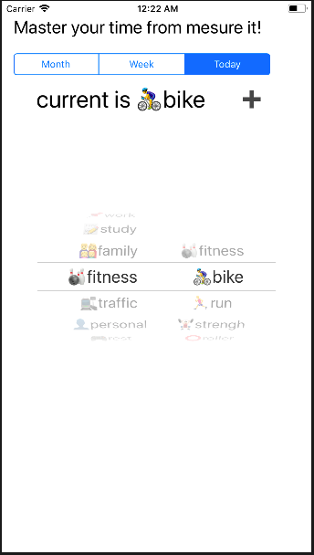

> 解析json初始化pickerview选择todo事项，一开始想把Picker的Datasource和Delegate独立出去，互相操作起来太复杂先放弃了以后再说吧。

### 常用的操作
- 重构： Command + click 可以调出选项转到定义
- 查找： Command + F
- 替换： Command + Option+F

### UIPickerView更新选项和设置默认项

``` bash
    public func pickerView(_ pickerView: UIPickerView, didSelectRow row: Int, inComponent component: Int){
        let select0 = picker.selectedRow(inComponent: 0)
        var index = select0 * 100 + component * row
        if(component==0){
            picker.reloadComponent(1) //重新加载二级选项
            picker.selectRow(1, inComponent: 1, animated: true) //二级选项里默认的索引是1
            index += 1
        }
        print("pickerView.delegate.didSelectRow[select0=\(select0),com=\(component),row=\(row)],index=\(index)")
        curLabel.text = "current is " + getLabel(index:index)
    }
```

