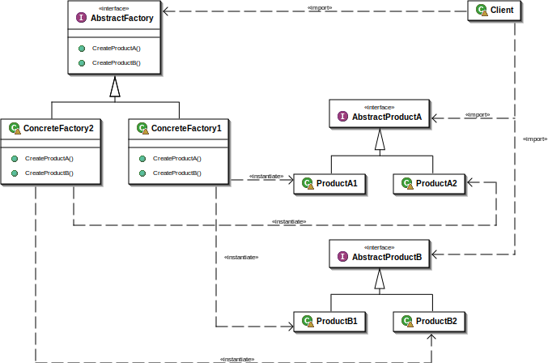

> 设计模式是用来解决常见的模式化的问题，这些问题有普遍的应用场景于是就这些场景的共同点提取出有针对性的解决方案。设计模式的位置在架构之下，架构面向的是系统的整体，比如分层，模块化，MVC，OO等等这些都属于架构模式。

## 工厂模式
工厂就是用来创建产品的。工厂模式分为简单工厂和抽象工厂两种，他们有几个不同点：一是简单工厂是个能直接用的工厂可以生产出实例，抽象工厂只是工厂模板不能用来创建实例。二是简单工厂隐藏来创建细节方便用户使用，抽象工厂把创建的细节交给用户去实现，实例是系统在使用。三抽象工厂不简单。抽象工厂是产品的创建的行为约束的模板(参考C++的模板类比如std::map)但不能直接用，必须根据模板创建出自己的工厂实例（比如std::map<int,string>）就可以用了）。抽象工厂是把产品设计和产品创建分离。这个过程像生产手机，设计部门关注的是结果，生产部门关注的是过程，设计部门不需要了解手机制造的细节，生产部门实现来这些技术细节。

抽象工厂需要系统架构支持，适用于有大量不同对象有统一行为但是创建方式不同的场景，同样的参数产生的对象是不一样的。比如参数化建模系统中，shapeFactory有CircleFactory和RectFactory两个实现，同样的参数1被这两个工厂调用createShape去创建产品，circleFactory创建的是单位圆，而RectFactory创建的是单位矩形。虽然创建的细节不一样但是把它们扔到画板中它们的旋转，移动，缩放、设置颜色线宽等等接口都是统一的，这些shape创建后是系统在操作他们。

ps：我一直不把C++的模板技术当作泛型编程，原因就是函数模版像宏的进化版，模版类是抽象的虽然从模版的角度看的确是做到了泛型，但是这个泛型的模版并不能直接去用必须靠程序员手动具型到一个具体类型去用，和动态泛型还有差距算是泛型的低级形态吧。

### 维基百科-抽象工厂
抽象工厂模式（英语：Abstract factory pattern）是一种软件开发设计模式。抽象工厂模式提供了一种方式，可以将一组具有同一主题的单独的工厂封装起来。在正常使用中，客户端程序需要创建抽象工厂的具体实现，然后使用抽象工厂作为接口来创建这一主题的具体对象。客户端程序不需要知道（或关心）它从这些内部的工厂方法中获得对象的具体类型，因为客户端程序仅使用这些对象的通用接口。抽象工厂模式将一组对象的实现细节与他们的一般使用分离开来。

> 如图抽象工厂需要配合系统的抽象产品一起用




``` bash
"""
Provide an interface for creating families of related or dependent
objects without specifying their concrete classes.
"""

import abc

class AbstractFactory(metaclass=abc.ABCMeta):
    """
    Declare an interface for operations that create abstract product
    objects.
    """

    @abc.abstractmethod
    def create_product_a(self):
        pass

    @abc.abstractmethod
    def create_product_b(self):
        pass


class ConcreteFactory1(AbstractFactory):
    """
    Implement the operations to create concrete product objects.
    """

    def create_product_a(self):
        return ConcreteProductA1()

    def create_product_b(self):
        return ConcreteProductB1()


class ConcreteFactory2(AbstractFactory):
    """
    Implement the operations to create concrete product objects.
    """

    def create_product_a(self):
        return ConcreteProductA2()

    def create_product_b(self):
        return ConcreteProductB2()


class AbstractProductA(metaclass=abc.ABCMeta):
    """
    Declare an interface for a type of product object.
    """

    @abc.abstractmethod
    def interface_a(self):
        pass


class ConcreteProductA1(AbstractProductA):
    """
    Define a product object to be created by the corresponding concrete
    factory.
    Implement the AbstractProduct interface.
    """

    def interface_a(self):
        pass


class ConcreteProductA2(AbstractProductA):
    """
    Define a product object to be created by the corresponding concrete
    factory.
    Implement the AbstractProduct interface.
    """

    def interface_a(self):
        pass


class AbstractProductB(metaclass=abc.ABCMeta):
    """
    Declare an interface for a type of product object.
    """

    @abc.abstractmethod
    def interface_b(self):
        pass


class ConcreteProductB1(AbstractProductB):
    """
    Define a product object to be created by the corresponding concrete
    factory.
    Implement the AbstractProduct interface.
    """

    def interface_b(self):
        pass


class ConcreteProductB2(AbstractProductB):
    """
    Define a product object to be created by the corresponding concrete
    factory.
    Implement the AbstractProduct interface.
    """

    def interface_b(self):
        pass


def main():
    for factory in (ConcreteFactory1(), ConcreteFactory2()):
        product_a = factory.create_product_a()
        product_b = factory.create_product_b()
        product_a.interface_a()
        product_b.interface_b()


if __name__ == "__main__":
    main()
```
Code above:[Abstract Factory in Python](https://sourcemaking.com/design_patterns/abstract_factory/python/1)