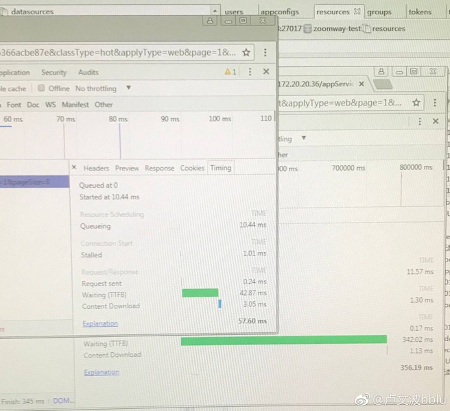

### 浏览器延迟加载的两种方式（默认情况下同步加载js脚本）
* defer 渲染完执行 <script src='path/to/mymodule.js' defer/>
* async 下载完执行 <script src='path/to/mymodule.js' async/>
* 但是浏览器加载ES6模块是异步加载的 <script type=‘module’ src='foo.js'/> 等同于打开defer属性

### CommonJS 和 ES6模块对比
CommonJS的一个模块就是一个js文件第一次被require后就会执行整个脚本，然后在内存中生成一个对象。
CommonJS模块输出的是一个值的复制，输出后模块内部变化和输出的值无关，ES6模块输出的是值的动态引用不缓存。
CommonJS模块是运行时加载，ES6模块是编译时输出接口。


* ES6中不输出任何对象的写法是 export{},只是为了向Node声明自己是一个ES6模块，否则就是CommonJS模块了。
* 在ES6模块中，默认情况下模块都是在严格模式下运行。
* 在模块中你可以使用import和export关键字。

### import加载模块的查找顺序和require一致
如果import一个CommonJS模块，Node会自动将module.exports属性当作模块的默认输出。

```js
import './foo'
//1st   ./foo.js
//2nd   ./foo/packange.json
//3rd   ./foo/index.js

import 'bar'
//1st   ./node_modules/bar.js
//2nd   ./node_modules/bar/packange.json
//3rd   ./node_modules/bar/index.js
//4th   goto parent folder...
```
### requireES6模块，ES6所有输出接口都会成为输入对象的属性


### Node加载模块

they're clear as what they look down below.


